 

  

## 👋 &nbsp;About me

I am **Subrata Pramanik**, a researcher at **IIIT Allahabad** working on **computer vision and pattern recognition**. Before research I was a software engineer at **TCS**.

- 🔬 &nbsp;**Research** — computer vision and pattern recognition
- 🎓 &nbsp;**Affiliation** — IIIT Allahabad · formerly TCS
- 📚 &nbsp;**Building** — the [**Learning Hub**](https://subrata-cs.github.io/learning-hub/)
- 🌐 &nbsp;**Website** — [subrata-cs.github.io](https://subrata-cs.github.io/)
- 📍 &nbsp;**Based in** — Kolkata, India

## 🔬 &nbsp;What I work on

<table>
<tr>
<td width="50%" valign="top">

**🖼️ Computer Vision**

Teaching a machine to read an image — where the objects are, what separates one region from the next, and what the picture is actually of.

</td>
<td width="50%" valign="top">

**🧩 Pattern Recognition**

The step underneath that: turning raw measurements into features, and features into a decision that holds up on data the model has never seen.

</td>
</tr>
</table>

## 📚 &nbsp;Featured — the Learning Hub

### **[→ subrata-cs.github.io/learning-hub](https://subrata-cs.github.io/learning-hub/)**

*One shelf for everything I am learning — arranged by subject, then by topic, then by the exact thing you came looking for.*

Every topic opens with the same five ways in:

<table>
<tr><td width="120" align="center">📖 <b>Description</b></td><td>The idea set out in full, in plain words.</td></tr>
<tr><td align="center">📝 <b>Notes</b></td><td>Compressed to what matters — the version you want the night before.</td></tr>
<tr><td align="center">🎓 <b>Tutorials</b></td><td>Walked through end to end, with nothing skipped.</td></tr>
<tr><td align="center">▶️ <b>Run your code</b></td><td>An environment that opens in one click.</td></tr>
<tr><td align="center">🚀 <b>Projects</b></td><td>Real builds, from a first attempt to something ambitious.</td></tr>
</table>

The subjects on the shelf: **Python · Data Structures & Algorithms · C · C Programming Practice · Machine Learning · Deep Learning · Computer Vision · Generative AI · Research Guide · Miscellaneous**. Notes are written in Markdown and rendered straight into the page, so the site is never out of date with the repositories behind it.

## 🛠️ &nbsp;Tools I reach for

 

 

## 📊 &nbsp;GitHub in numbers

Everything below is read live from the GitHub API — nothing here is typed in by hand.

  

  

 

  

## 🤝 &nbsp;Reach me

  

A question about a paper, a dataset or a stubborn bug — open an issue on any repository and start there.

**Subrata Pramanik** &nbsp;·&nbsp; Computer Vision &amp; Pattern Recognition &nbsp;·&nbsp; IIIT Allahabad

Everything I learn ends up on the shelf. Free to read, free to share.

